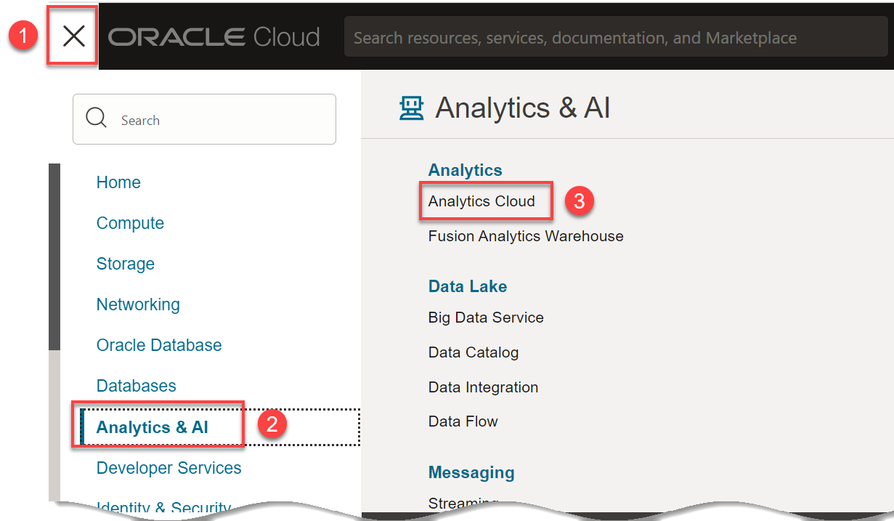
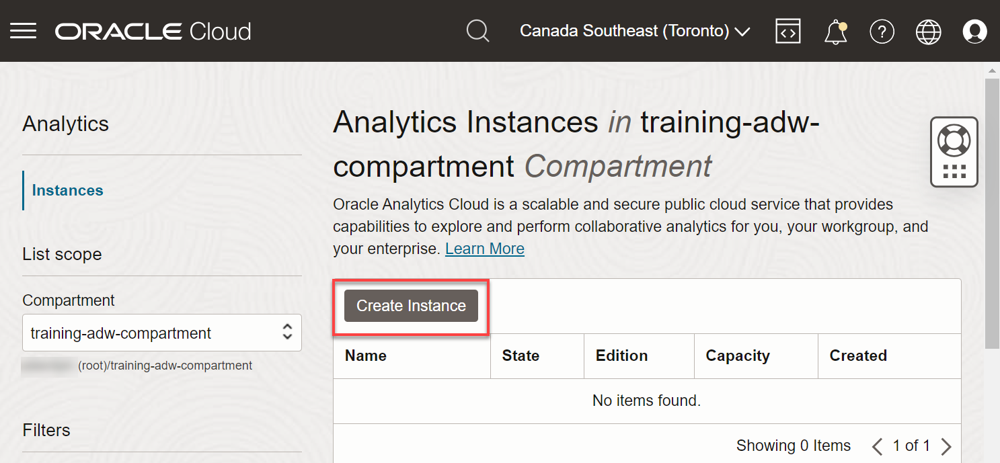
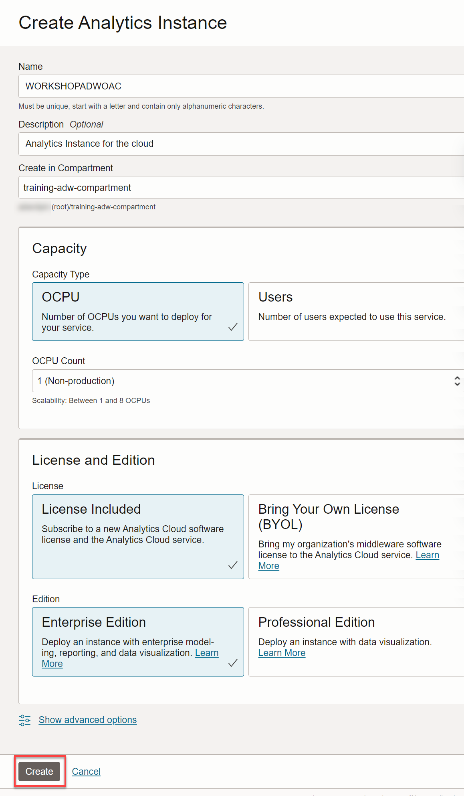
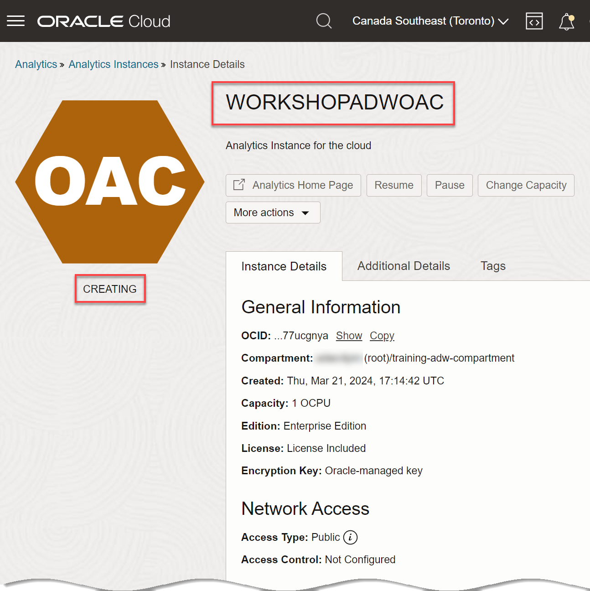
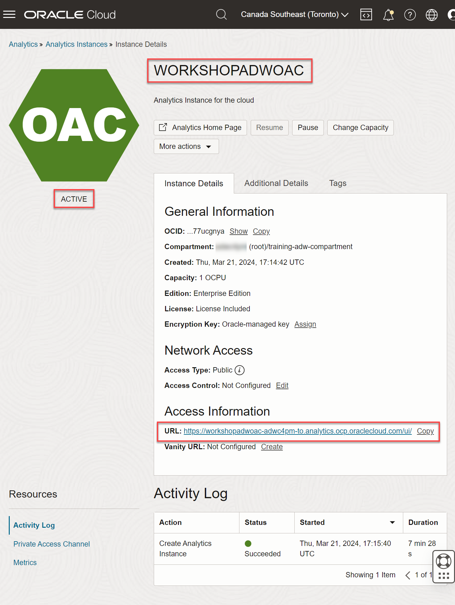

<!--
    {
        "name":"Provision Your Oracle Analytics Cloud (OAC) Instance",
        "description":"Show how to create a new OAC instance"
    }
-->
# Provision Your Oracle Analytics Cloud (OAC) Instance

## Introduction

> **Important:** _Oracle Analytics Cloud (OAC) is not available with Oracle Cloud Free Tier (Always Free), nor is it supported in Oracle LiveLabs Sandbox hosted environments (the Green button). If you run this workshop using an Always Free database or a LiveLabs Sandbox environment, you can review **Lab 1** and **Lab 5** **without provisioning and using OAC**, and later practice the two labs on **Oracle Autonomous Database** and **OAC** in your organization’s own tenancy._

In this lab, you provision an **Oracle Analytics Cloud (OAC)** instance on Oracle Cloud Infrastructure, which you will use to analyze your data in the **Develop Self-Service Analytics Cloud Dashboards** lab in this workshop.

Provisioning an Oracle Analytics Cloud instance can take over **20+ minutes**. We position this lab first, so that the OAC instance can provision while you proceed with the following labs.

Also...

> **Note**: If you attend this workshop at CloudWorld or another in-person instructor-led event, your instructor will direct you to skip this lab, providing you a link to  an already-provisioned OAC instance.

Watch our short video that explains how to provision your Oracle Analytics Cloud instance:

> Note: Please disregard the video's reference to **Lab 2**.

Estimated Time: 20+ minutes.

### Objectives
- Create an Oracle Analytics Cloud Instance

## Task 1: Create an Oracle Analytics Cloud (OAC) Instance

1. Log in to the Oracle Cloud Console as the Cloud Administrator using the instructions in the **Get Started** lab in the **Contents** menu on the left.

2. Click the **Profile** icon in the top right side of the banner. 

    If your username is shown in the following format, then you are **connected** as a **Single Sign On** user.

    - oracleidentitycloudservice/&lt;your username&gt;

        

    If your username is shown in the following format, then you are **signed in** as an **Oracle Cloud Infrastructure** user.

    - &lt;your username&gt;

    >**Note:** If your user does not contain the identity provider (**oracleidentitycloudprovider**), please log out and select to authenticate
    using **Single Sign On**. To enable using **Oracle Analytics Cloud**, we need to sign on as a **Single Sign-On** (SSO) user. For more information about federated users, see the [User Provisioning for Federated Users](https://docs.cloud.oracle.com/en-us/iaas/Content/Identity/Tasks/usingscim.htm) documentation.

3. Return to the **Console** Home page. Open the Navigation menu and click **Analytics & AI**. Under **Analytics**, click **Analytics Cloud**.

    

    > **Note**: You must be connected as a **Single Sign On** (**Federated user**) user to a tenancy, which has available cloud credits to see this menu item. Local OCI users are not able to do this.

4. On the **Analytics Instances** page, select your compartment from the **Compartment** drop-down list in the **List Scope** section. Next, click **Create Instance**.

    

5. On the **Create Analytics Instance** panel, specify the following: 
    * **Compartment:** Select your compartment.
    * **Instance Name:** .
    * **Description:** Analytics Instance for the cloud.
    * **Capacity Type:** OCPU.
    * **OCPU Count:** 1 (Non Production).
    * **License Type:** License Included.
    * **License Edition:** Enterprise Edition.

        

6. Click **Create**. The Analytics instance page will be displayed with a status of **CREATING**.

    

    ***Reminder***: Provisioning an Oracle Analytics Cloud instance can take over **20+ minutes**.

6. When provisioning is complete, the status of your Analytics instance changes to **ACTIVE**.

    

You may now proceed to the next lab.

## **Acknowledgements**

- **Authors:**
    * Priscila Iruela - Technology Product Strategy Director
    * Juan Antonio Martin Pedro - Analytics Business Development
    * Lauran K. Serhal, Consulting User Assistance Developer

- **Contributors:**
    * Victor Martin
    * Melanie Ashworth-March
    * Andrea Zengin

- **Last Updated By/Date:** Lauran K. Serhal, March 2024
