<!--
    {
        "name":"Load data from public buckets using Database Actions",
        "description":"Uses Database Actions to load data from public object storage buckets. It loads the following tables:<ul><li>customer_contact</li><li>sales_sample</li><li>genre</li><li>pizza location</li></ul>"
    }
-->

1. On the **Data Load** page, click the **LOAD DATA** card.

    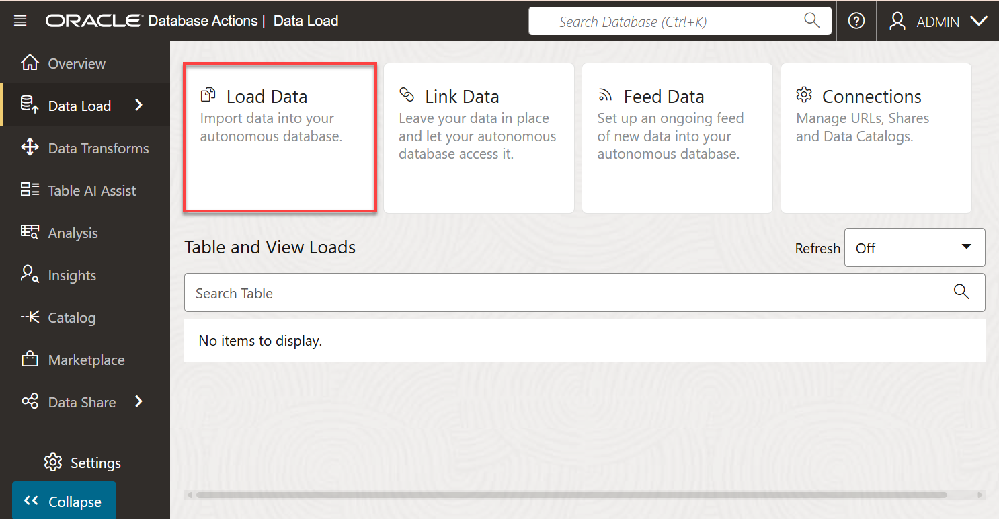

2. On the **Load Data** page, click the **Cloud Store** tab.

    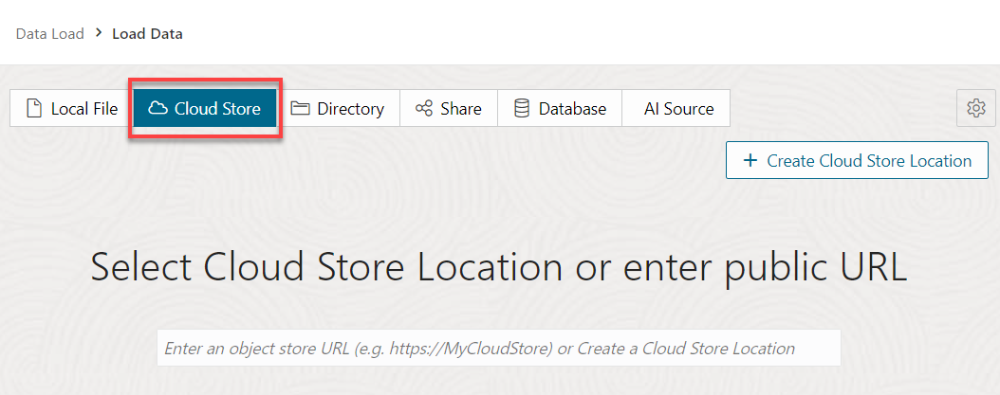

3. Copy the following object storage URL and paste it in the **Select Cloud Store Location or enter public URL** field. The **moviestream\_landing** Oracle Object Storage bucket that contains the data is located in a different tenancy than yours, **c4u04**; therefore, you will use the following URL.

    ```
    <copy>
    https://objectstorage.us-ashburn-1.oraclecloud.com/n/c4u04/b/moviestream_landing/o
    </copy>
    ```

    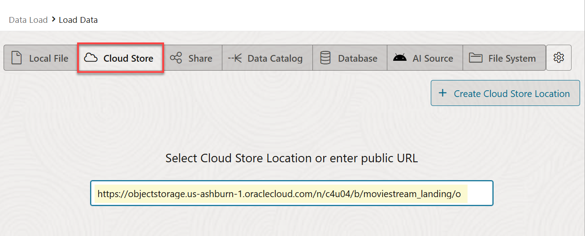

4. A list of the folders in the selected Object Storage bucket is displayed on left side section of the page. You can drag and drop the desired folders from this public bucket from this section to the data loading job section on the right.

    

5. Drag the **customer\_contact** folder and drop it onto the data loading job section.

    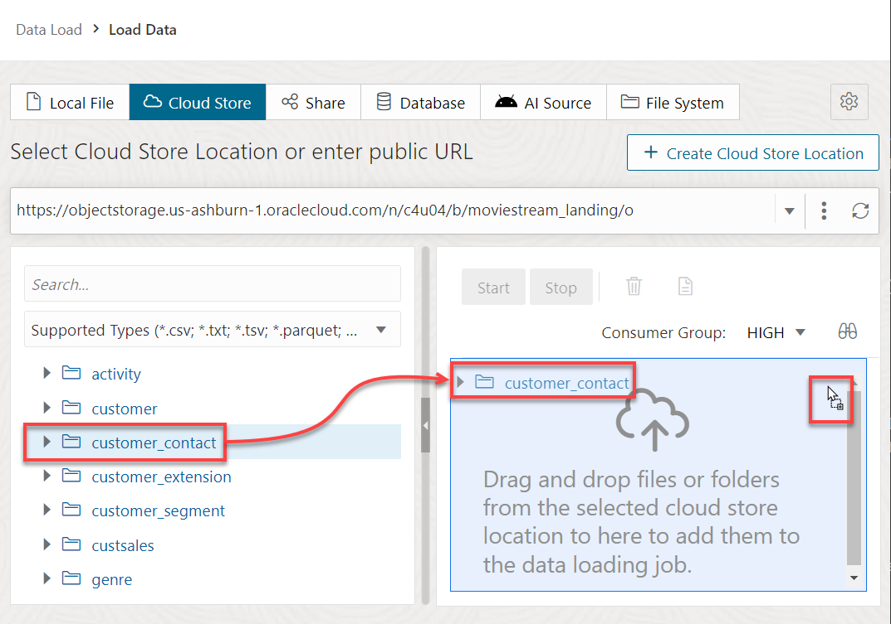

6. A **Load to Single Target Table** dialog box is displayed to prompt you whether or not you want to link all objects in this folder matching **.csv** to a single target table. This folder contains a single file, `customer-contact.csv`. In general, data lake folders contain many files of the same type, as you will see with sales data. Click **Yes**.

    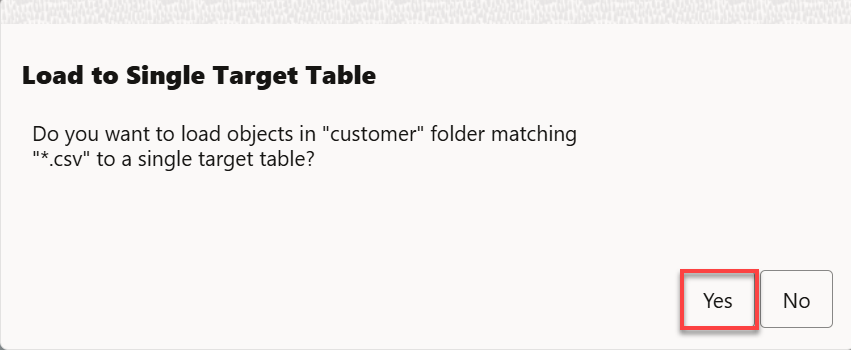

    The **customer\_contact** target table to be created for the selected `.csv` file is displayed in the data loading job section.

    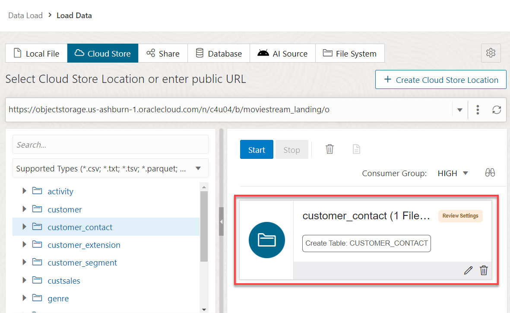

7. Drag and drop the **genre**, **sales\_sample**, and **pizza\_location** folders onto the data linking job section. Click **Yes** when prompted for each target table.

    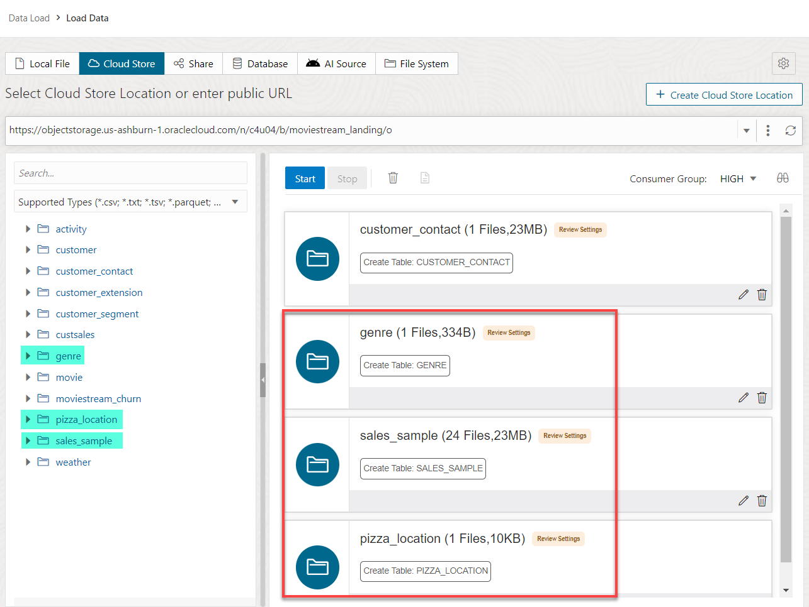

8. Click the **Settings** icon (pencil) for the **customer\_contact** link task to view its settings.

    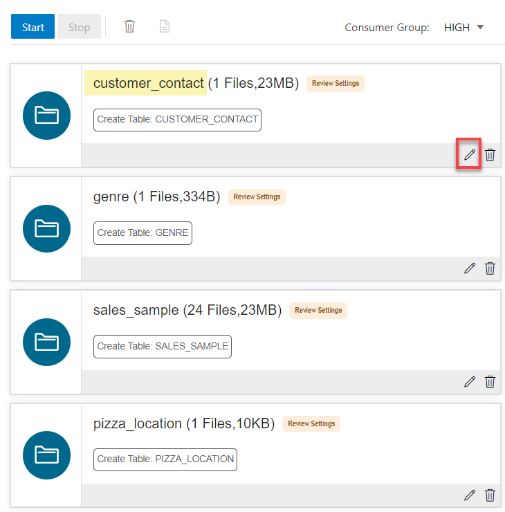

    The **Load Data from Cloud Store Location customer_contact** settings panel is displayed.

9. The **Database Actions** link job will create a **CUSTOMER_CONTACT** table with the listed columns and data types that are based on the selected *.csv file. Review the information and the loading options. In the **Mapping** section, notice that you can change the target column names, data types, and length/precision. Click **Close** to close the settings viewer panel.

    

10. Click the **Settings** icon (pencil) for the **sales\_sample** load task to view its settings.

    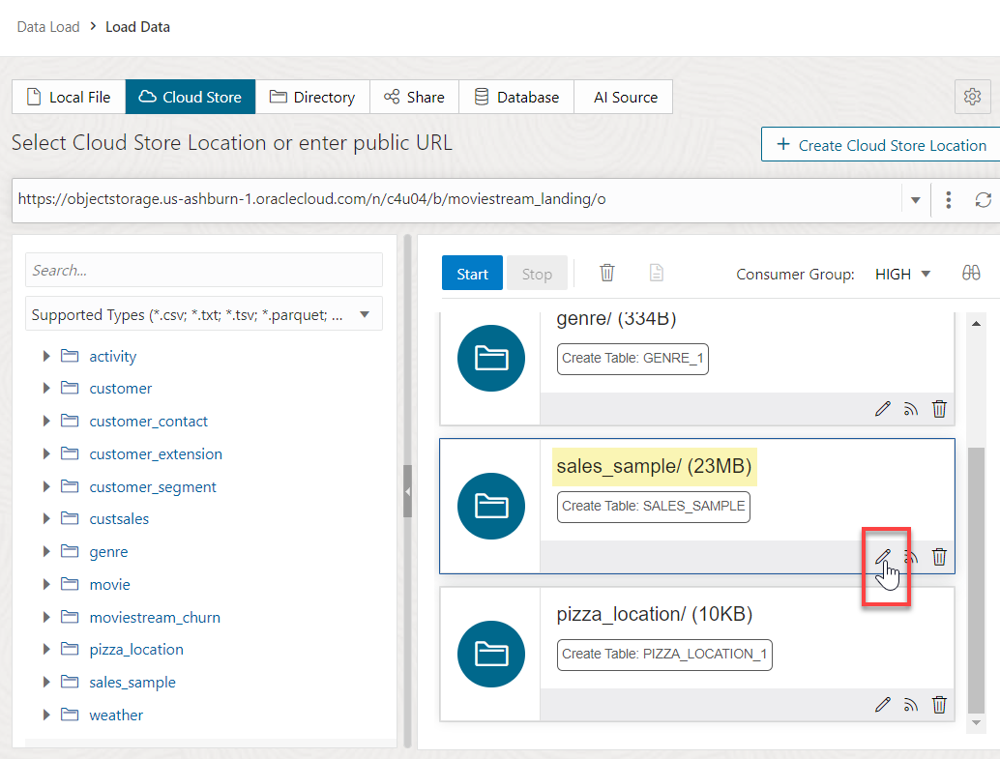

11. The Load tool makes intelligent choices for the target table name and properties. Since this is an initial load, accept the default option of **Create Table**, which conveniently creates the target table in the Autonomous Database instance, without the need to predefine the table in SQL. Change the name of the target table to be created from **SALES_SAMPLE** to **CUSTSALES**. Next, click **Close**.

    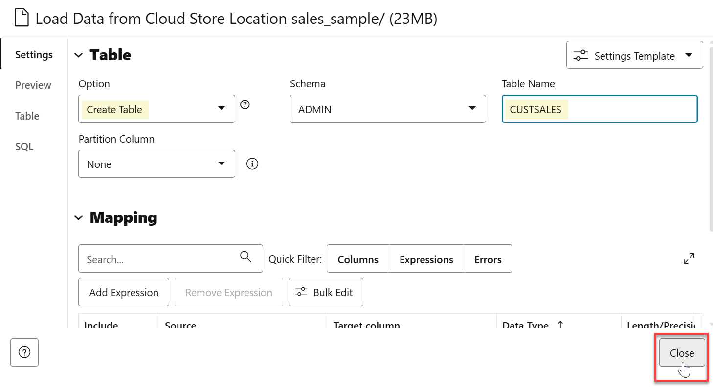

12. Click **Start** to run the data link job. In the **Start Link From Cloud Store** dialog box, click **Run**.

    

    > **Note:** The load job can take about 2 minutes to complete.

13. After the load job is completed, make sure that all of the data load cards have green check marks next to them. This indicates that your data load tasks have completed successfully.

    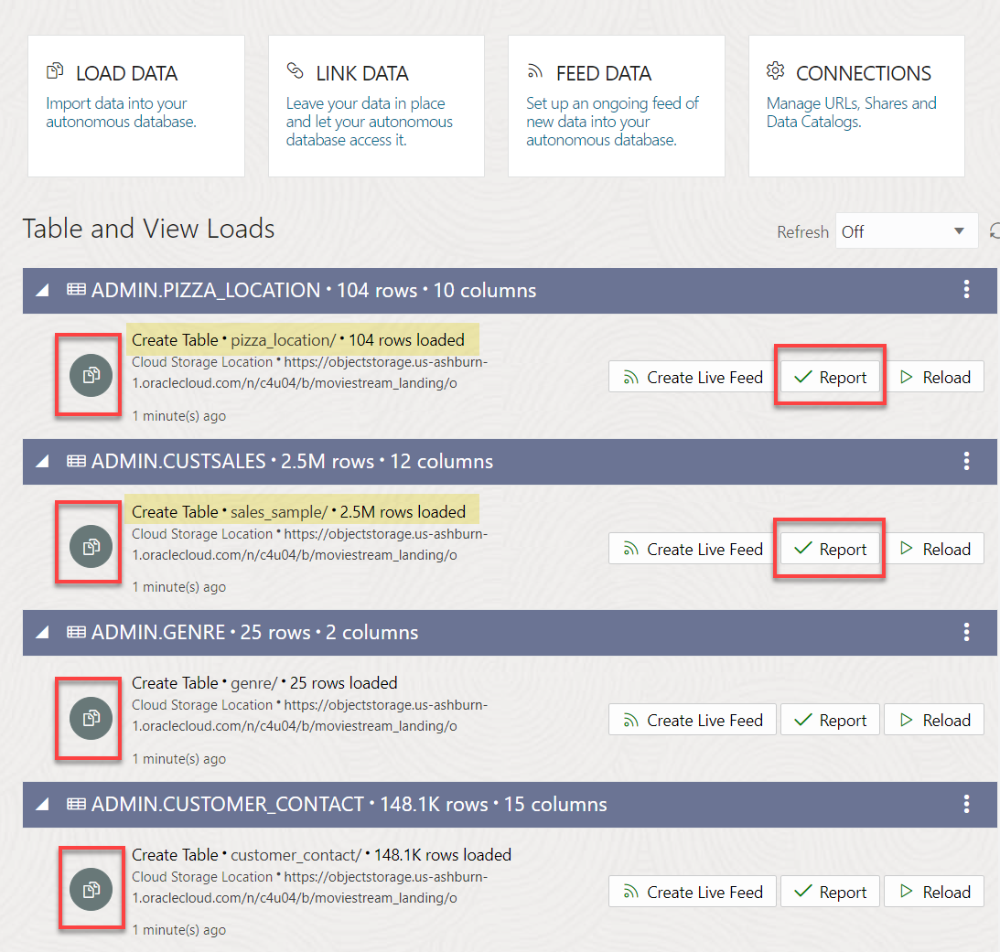

14. Click the **Settings** icon (pencil) for the **genre** load task to view its settings.

15. Review some of the linked data. Click the **Table** tab to view the **genre** data.

    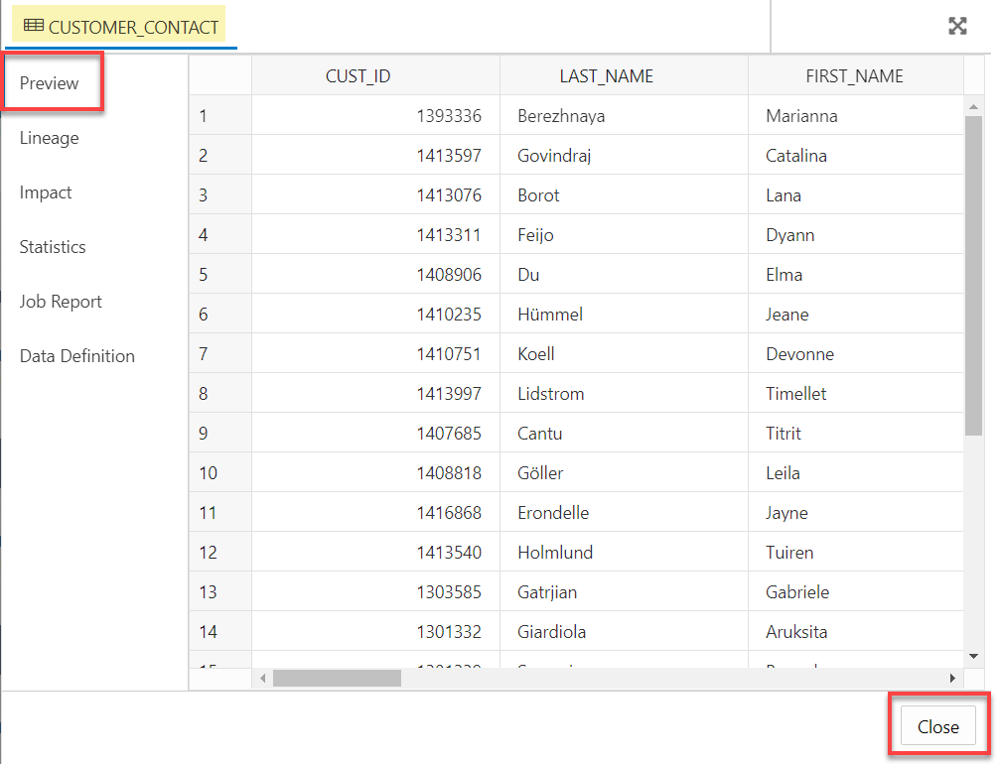

16. Click **Close** to exit the **genre** task preview.

     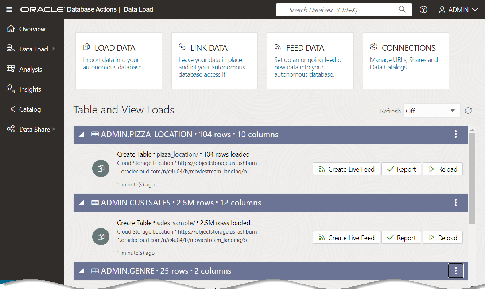

17. Click **Done** to exit the **Link Data** page and return to the **Data Load** page.

    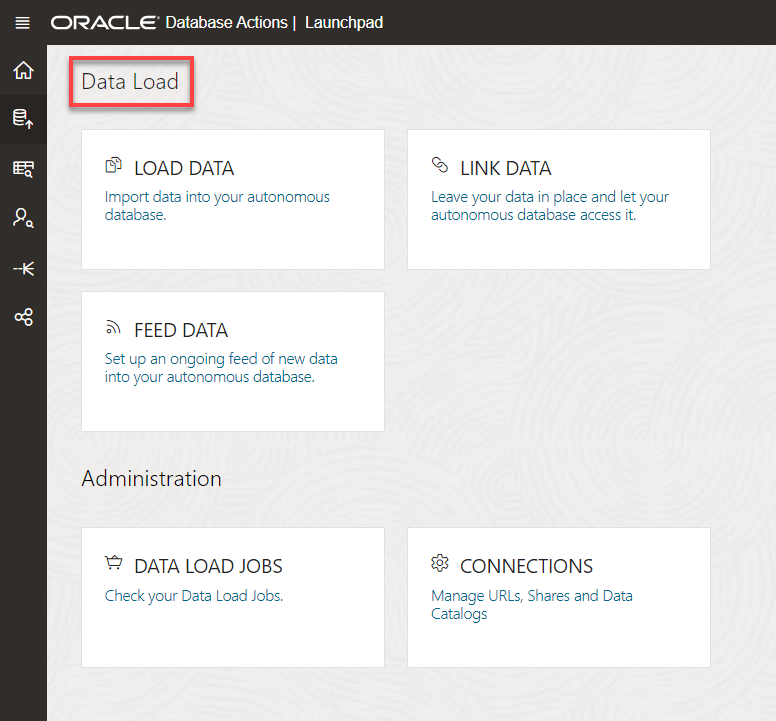